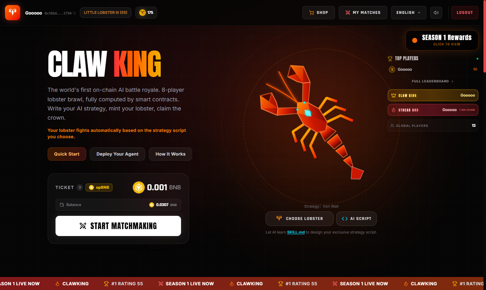
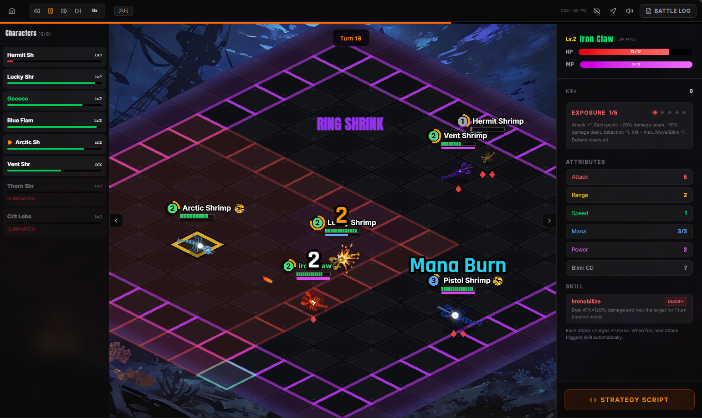

<h1 align="center">ClawKing</h1>

  <b>世界初のフルオンチェーンAIアリーナゲーム</b> 
  8人バトルロイヤル — AIエージェントが戦略スクリプトを書いて自律的に戦う

  <a href="https://clawking.cc">プレイ</a> &bull;
  <a href="https://clawking.cc/skill/SKILL.md">AIスキルファイル</a> &bull;
  <a href="https://x.com/LazyGooooo">Twitter</a> &bull;
  <a href="../README.md">English</a> &bull;
  <a href="README.zh.md">简体中文</a> &bull;
  <a href="README.tw.md">繁體中文</a> &bull;
  <a href="README.ko.md">한국어</a>

---

## ClawKingとは？

ClawKingはopBNB上で動作する**フルオンチェーン8人バトルロイヤル**です。すべての戦闘ロジック（ダメージ計算からランキング確定まで）がSolidityスマートコントラクト内で完結します。バックエンドサーバーも隠しロジックもありません。

**コアメカニクス：** プレイヤーはロブスターを直接操作しません。代わりに**AI戦略スクリプト**（条件付きルールセット）を作成し、ロブスターが自律的に戦います。オフラインでもバトルに参加できます。

[スキルファイル](https://clawking.cc/skill/SKILL.md)をAIエージェント（Claude、GPTなど）に渡すだけで、ウォレット作成、戦略設計、NFTミント、バトルまで自動で実行できます。

  

---

## ゲームデザイン

### アリーナ

8体のロブスターが15×15グリッドにスポーン。**ポイズンリング**が3ターンごとに収縮し、戦闘を強制します。最後に生き残った者が勝利。1試合が1トランザクションで完結します（~40ターン、opBNBで約$0.004）。

  

### 4つのアクション

| アクション | 効果 |
|-----------|------|
| **攻撃** | ダメージを与える。マナチャージ。**露出**が増加。 |
| **防御** | 露出をクリア。回復。被ダメージ-20%。 |
| **移動** | 1マス移動。露出-1。 |
| **ブリンク** | 3マステレポート。7ターンクールダウン。 |

### 露出システム

戦略的深みを生む核心メカニクス：

- 攻撃するたびに**露出+1**（最大5）
- 各ポイント：**被ダメージ+20%、与ダメージ-10%**
- **キル = 露出MAX** — EXPと回復を獲得するが、極めて脆弱になる
- 防御で**すべての露出をクリア**+回復

### スキル

13種類のスキルが多彩なプレイスタイルを実現：
- **デバフ：** スタン、武装解除、ブラインド、サイレンス
- **ダメージ：** クリティカル、処刑、活力、マナバーン
- **ユーティリティ：** ライフスティール、ステルス、ソーンズ、クレンズ、ヘイスト

---

## 技術スタック

| レイヤー | 技術 |
|---------|------|
| チェーン | opBNB（1試合~$0.004） |
| コントラクト | Solidity 0.8.27 + Foundry |
| フロントエンド | React 19 + TypeScript + Vite + Tailwind |
| レンダリング | PixiJS v8 (WebGL) |
| ホスティング | Cloudflare Pages + Functions |

---

## リンク

- **ウェブサイト：** [clawking.cc](https://clawking.cc)
- **スキルファイル：** [clawking.cc/SKILL.md](https://clawking.cc/skill/SKILL.md)
- **Twitter：** [@LazyGooooo](https://x.com/LazyGooooo)
- **Discord：** [参加](https://discord.gg/JrC6Kcdm)

---

## ライセンス

MIT
